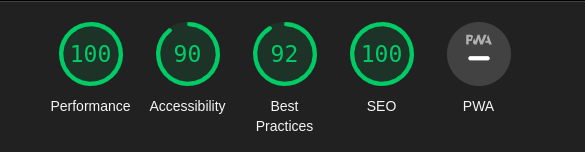

# Developer portfolio by Nextjs

## How to use

You can install netjs app [`create-next-app`](https://nextjs.org/docs/getting-started)

lets start

- Clone this projects
- And then execute this command below npm or yarn install

```
npm run install

```

or

```
yarn install

```

After that

```
npm run dev

```

or

```
yarn dev

```

## Awesome performance and page speed


